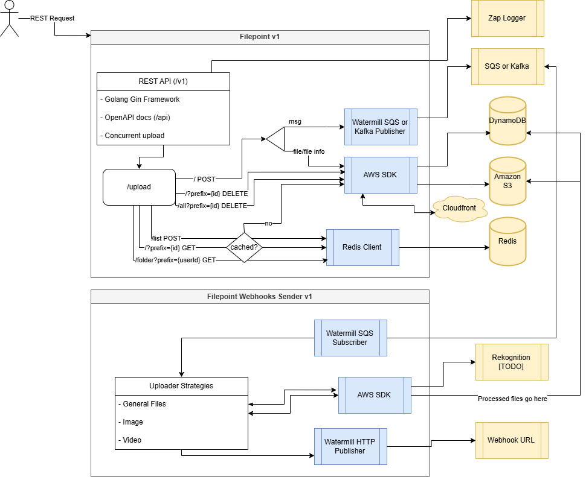

# Filepoint

Filepoint is the Gearpoint's file manager service. It's built for performance.

## Tech Stack

- [Golang](https://go.dev/)
- [Gin Framework](https://gin-gonic.com/)
- **Logs and tracing**
  - [Zap Logger](https://github.com/uber-go/zap)
  - [Zap Logger Gin Middleware](https://github.com/gin-contrib/zap)
  - [OpenTelemetry](https://opentelemetry.io/)
  - [OpenTelemetry for Go](https://opentelemetry.io/docs/instrumentation/go/)
- **Pub/Sub and Kafka**
  - [Apache Kafka](https://kafka.apache.org/get-started)
  - [Sarama Apache Kafka Go Library](https://github.com/IBM/sarama)
  - [Watermill](https://github.com/ThreeDotsLabs/watermill)
  - [Watermill Kafka Pub/Sub Implementation](https://github.com/ThreeDotsLabs/watermill-kafka)
  - [Watermill Http Pub/Sub Implementation](https://github.com/ThreeDotsLabs/watermill-http)
- **Caching**
  - [Redis](https://redis.io/)
  - [Redis client for Go](https://github.com/redis/go-redis)
- **Docs**
  - [Swagger](https://swagger.io/)
  - [Gin Swagger](https://github.com/swaggo/gin-swagger)
- **AWS**
  - [AWS S3](https://docs.aws.amazon.com/s3/)
  - [AWS Cloudfront](https://aws.amazon.com/cloudfront/)
  - [AWS Rekognition](https://aws.amazon.com/rekognition/)
- **File Handle**
  - [libvips](https://github.com/libvips/libvips)
  - [bimg](https://github.com/h2non/bimg)

## The project



## Building and running

First of all, set the environment file:

```sh
cp .env.example .env
```

Then, you need to setup [LocalStack](https://www.localstack.cloud/):

```sh
python3 -m pip install localstack
pip install awscli-local
```

### Running in Go

To run the project with go, use the following command:

```sh
# Filepoint API
make run

# Filepoint webhooks provider
make run-webhooks-provider
```

Pay attention that you must have the following services running:

- Redis
- LocalStack

### The binary

To build the binary, use the available command in Makefile:

```sh
make build-local
```

### Docker image

For the Docker image, use this Makefile command:

```sh
make build-image
```

### Docker Compose

Just run:

```sh
docker compose build && docker compose up
```

## Signing Cloudfront URLs

To sign the Cloudfront URLs, you must provide a valid private key in PEM format. The public key has to be registered in the Cloudfront configuration as well.

You can check it in the [docs](https://docs.aws.amazon.com/AmazonCloudFront/latest/DeveloperGuide/private-content-trusted-signers.html).

The key must be in the ```.aws``` folder.

> Local setups don't need signed URLs.

## Setting up the Container Registry

AWS ECR is being used as the Container Registry.

### Configuring

1. Configure [aws cli](https://aws.amazon.com/cli/):

    ```sh
    aws configure # use your credentials here
    ```

2. Authenticate in Docker:

    For this step, use Docker GUI or docker login command.

    Then, execute the following:

    ```sh
    aws ecr get-login-password --region us-east-1 | docker login --username AWS --password-stdin {{ REGISTRY }}
    ```

    Now, you should see "Login Succeeded"

### Pulling

To pull from ECR private repositories, you must first be authenticated in AWS:

docker login
docker pull gearpoint/filepoint
docker pull gearpoint/filepoint-webhooks-sender

```sh
docker pull {{ REGISTRY }}/prod-filepoint-repo
docker pull {{ REGISTRY }}/prod-filepoint-webhooks-repo
```

### Publishing

To publish to Docker Hub, you must build, tag and push your images:

```sh
make build-base # only first time
make build-images
make publish-filepoint
make publish-webhooks-sender
```
